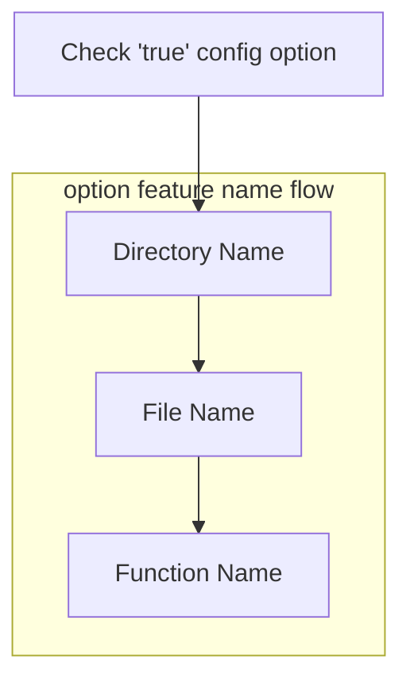

# About Config Read Me

The seis-automation-box currently has two configuration files: Essential Info and Option Inst. This toolbox doesn't store or transmit any of your information. It's open source, so you can review its code and even build it yourself.

Before running the executable, please update the contents of the config files to reflect your own settings.

## Content description

**essentail** **Info**

```json
{
    "infoName1": "your content",
    "infoName2": "your content"
}
```

Currently, seis-automation-box would build:

### Mac

- Homebrew
- Git
- Git Credential
- ITerm2
- ZSH

### Linux

- Update apt and apt-get
- Git
- Git Credential

### Windows

- Winget
- Git
- Git Credential
- Windows Terminal from git

**option** **Inst**

optionInst.json is a list of all optional features. Set the ones you'd like to install to true.

How it judge:



```json
{
    "Directory1":
    {
        "Filename/Funcname": true/false,
        "Filename/Funcname": true/false
    },
    "Directory2":
    {
        "Filename/Funcname": true/false,
        "Filename/Funcname": true/false
    }
}
```

For example, the vscode option:

```json
{
    "vscode": {
        "InstThevscode": true
    }
}
```

which means, it will run 'Thevscode' func located in 'internal/optionalFeatures/vscode/Inst.go' File.

Please follow upper camel case.
